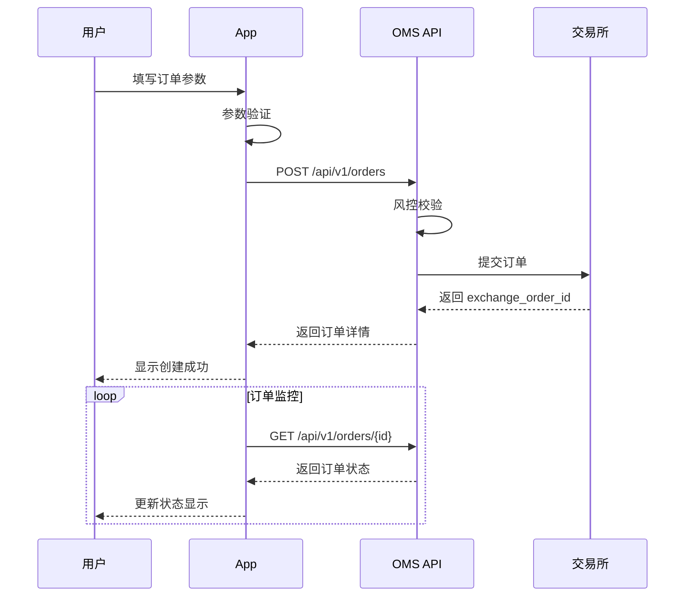
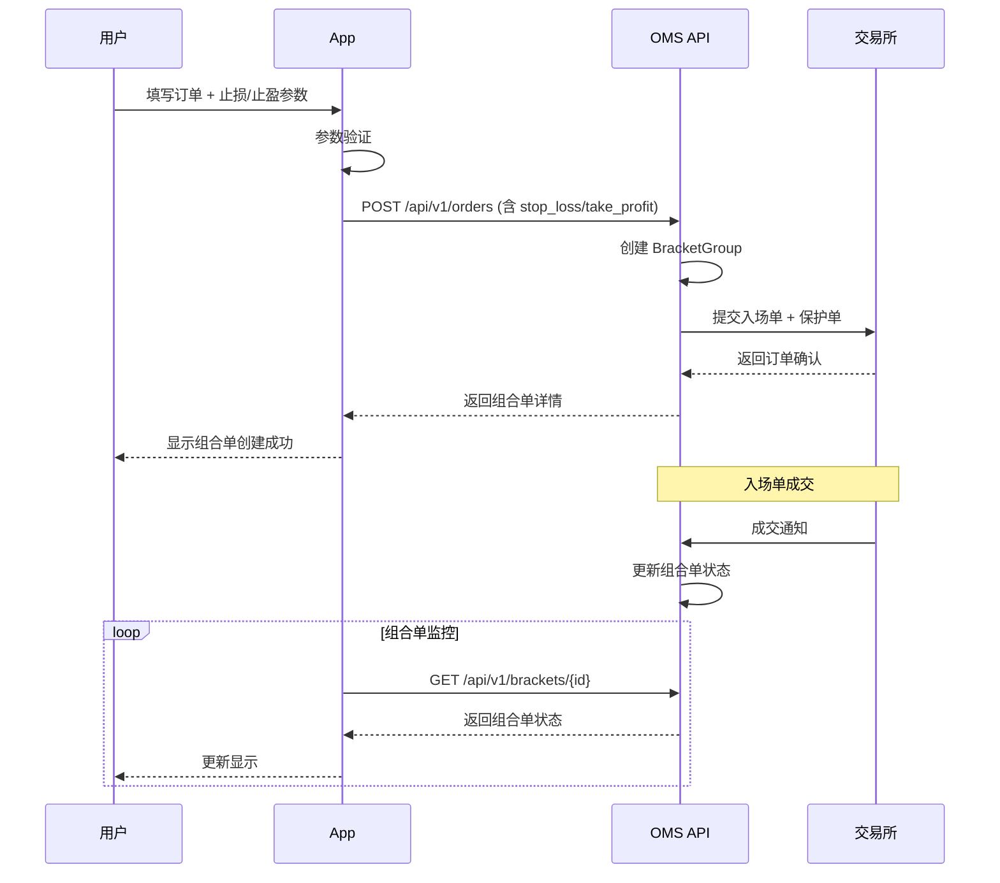
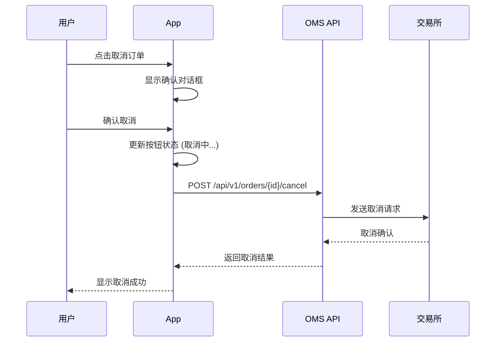

# App 应用平台 OMS 集成需求文档

> 版本: v1.0.0
> 更新日期: 2026-01-30
> 文档状态: 正式版

---

## 目录

- [1. 概述](#1-概述)
- [2. 功能需求](#2-功能需求)
- [3. 技术需求](#3-技术需求)
- [4. 界面设计参考](#4-界面设计参考)
- [5. 业务流程](#5-业务流程)
- [6. 数据字典](#6-数据字典)
- [7. 非功能性需求](#7-非功能性需求)
- [8. 测试要求](#8-测试要求)

---

## 1. 概述

### 1.1 背景

OMS (Order Management System) 是交易系统的核心组件，负责订单的创建、管理、执行和监控。App 应用平台需要集成 OMS API，为用户提供完整的订单管理功能。

### 1.2 目标

- 实现完整的订单生命周期管理
- 支持多交易所 (Binance, OKX, Gate.io)
- 支持现货和合约交易
- 支持组合单 (Bracket Order) 止损/止盈功能
- 提供实时订单状态更新
- 提供直观的订单监控界面

### 1.3 适用范围

本文档适用于 App 应用平台的前端开发团队，涵盖与 OMS REST API 集成的所有功能需求。

### 1.4 术语定义

| 术语 | 定义 |
|-----|------|
| OMS | Order Management System - 订单管理系统 |
| Bracket Order | 组合单，包含入场单 + 止损单 + 止盈单 |
| Stop Loss (SL) | 止损单，用于限制亏损 |
| Take Profit (TP) | 止盈单，用于锁定利润 |
| client_order_id | 客户端订单ID，由 OMS 生成 |
| exchange_order_id | 交易所订单ID，由交易所返回 |
| trace_id | 分布式追踪ID，用于问题排查 |

---

## 2. 功能需求

### 2.1 订单创建模块

#### 2.1.1 标准订单创建

**功能描述**: 用户可以创建标准的限价单或市价单。

**前置条件**:
- 用户已登录
- 用户已选择交易账户
- 账户有足够余额

**输入参数**:

| 字段 | 必填 | UI组件 | 验证规则 |
|-----|-----|--------|---------|
| 交易账户 | 是 | 下拉选择 | 从已配置账户列表选择 |
| 交易对 | 是 | 下拉选择/搜索 | 格式: BASE_QUOTE.EXCHANGE |
| 买卖方向 | 是 | 切换按钮 | BUY / SELL |
| 订单类型 | 是 | 切换按钮 | LIMIT / MARKET |
| 价格 | 条件 | 数字输入 | LIMIT 必填，> 0 |
| 数量 | 条件 | 数字输入 | 与金额二选一，> 0 |
| 金额 | 条件 | 数字输入 | 仅 BUY 可用，> 0 |
| 策略 | 是 | 下拉选择 | 从策略列表选择 |

**业务逻辑**:
1. 用户选择账户后，加载该账户可用余额
2. 选择交易对后，加载当前市场价格
3. 输入数量时，自动计算预估金额
4. 输入金额时，自动计算预估数量
5. 提交前进行参数验证

**UI 交互**:
- 显示可用余额
- 显示当前市场价格
- 支持快捷数量选择 (25%, 50%, 75%, 100%)
- 限价单支持价格增减按钮
- 提交按钮显示预估成交信息

**成功响应处理**:
- 显示订单创建成功提示
- 显示订单号 (client_order_id)
- 跳转到订单详情或订单列表

**错误处理**:
- 余额不足: 显示当前可用余额，提示充值
- 参数错误: 高亮错误字段，显示具体错误信息
- 网络错误: 显示重试按钮

---

#### 2.1.2 组合单 (Bracket Order) 创建

**功能描述**: 用户可以创建带止损/止盈的组合单，一次性设置入场、止损、止盈三个订单。

**额外输入参数**:

| 字段 | 必填 | UI组件 | 验证规则 |
|-----|-----|--------|---------|
| 启用止损 | 否 | 开关 | 布尔值 |
| 止损类型 | 条件 | 下拉 | STOP_MARKET / STOP_LIMIT |
| 止损触发方式 | 条件 | 切换 | PERCENT / FIXED |
| 止损价格 | 条件 | 数字输入 | 固定价格模式必填 |
| 止损百分比 | 条件 | 数字输入 | 百分比模式必填，0.1-50% |
| 止损限价 | 条件 | 数字输入 | STOP_LIMIT 类型可选 |
| 止损触发价格源 | 条件 | 切换 | MARK_PRICE / LAST_PRICE |
| 启用止盈 | 否 | 开关 | 布尔值 |
| 止盈类型 | 条件 | 下拉 | TAKE_PROFIT_MARKET / TAKE_PROFIT_LIMIT |
| 止盈触发方式 | 条件 | 切换 | PERCENT / FIXED |
| 止盈价格 | 条件 | 数字输入 | 固定价格模式必填 |
| 止盈百分比 | 条件 | 数字输入 | 百分比模式必填，0.1-1000% |
| 止盈限价 | 条件 | 数字输入 | TAKE_PROFIT_LIMIT 类型可选 |
| 止盈触发价格源 | 条件 | 切换 | MARK_PRICE / LAST_PRICE |

**业务逻辑**:
1. 启用止损后，展开止损配置面板
2. 选择百分比模式时，根据入场价格自动计算止损价格
3. 选择固定价格模式时，验证价格合理性
4. 止损价格应低于入场价格 (BUY) 或高于入场价格 (SELL)
5. 止盈价格应高于入场价格 (BUY) 或低于入场价格 (SELL)

**UI 交互**:
- 显示风险收益比 (RR Ratio)
- 显示预估盈亏金额
- 价格可视化图表 (可选)
- 止损/止盈价格与当前价格的差距百分比

**响应处理**:
- 显示组合单创建成功
- 显示三个订单的状态 (入场、止损、止盈)
- 显示组合单 ID (bracket_id)

---

#### 2.1.3 附加止损/止盈

**功能描述**: 为已成交的订单附加止损和/或止盈保护。

**前置条件**:
- 订单状态为 FILLED
- 订单不属于其他组合单

**输入参数**:

| 字段 | 必填 | UI组件 | 验证规则 |
|-----|-----|--------|---------|
| 订单ID | 是 | 自动填充 | 从已成交订单选择 |
| 止损配置 | 条件 | 展开面板 | 至少设置止损或止盈其一 |
| 止盈配置 | 条件 | 展开面板 | 至少设置止损或止盈其一 |

**UI 交互**:
- 从已成交订单列表选择
- 显示订单的成交价格和数量
- 根据成交价格预计算止损/止盈价格

---

### 2.2 订单管理模块

#### 2.2.1 订单列表

**功能描述**: 展示用户的订单列表，支持多维度筛选和排序。

**筛选条件**:

| 筛选项 | UI组件 | 选项 |
|-------|--------|------|
| 账户 | 下拉多选 | 用户关联的所有账户 |
| 交易对 | 搜索输入 | 自动补全 |
| 交易所 | 复选框 | BNC / OKX / GIO |
| 方向 | 复选框 | BUY / SELL |
| 状态 | 复选框组 | 见状态枚举 |
| 时间范围 | 日期选择器 | 开始-结束 |
| 策略 | 下拉多选 | 策略列表 |

**快捷筛选**:
- 全部订单
- 活跃订单 (NEW, PARTIALLY_FILLED)
- 已完成 (FILLED)
- 已取消 (CANCELED, REJECTED, FAILED)
- 今日订单

**列表列定义**:

| 列名 | 数据字段 | 排序 | 说明 |
|-----|---------|-----|------|
| 订单号 | client_order_id | 否 | 点击复制 |
| 交易对 | symbol | 是 | 显示简化格式 |
| 账户 | account | 是 | - |
| 方向 | side | 是 | BUY 绿色, SELL 红色 |
| 类型 | order_type | 是 | - |
| 价格 | price | 是 | 市价单显示 "市价" |
| 数量 | quantity | 是 | - |
| 已成交 | filled_qty | 是 | 显示进度条 |
| 状态 | status | 是 | 状态标签颜色区分 |
| 创建时间 | created_at | 是 | 默认排序字段 |
| 操作 | - | 否 | 查看详情、取消 |

**分页**:
- 每页默认 50 条
- 支持 20/50/100 切换
- 显示总数和当前页码

**实时更新**:
- 活跃订单自动刷新 (建议 5-10 秒)
- 状态变更推送 (如有 WebSocket)

---

#### 2.2.2 订单详情

**功能描述**: 展示单个订单的完整信息。

**信息分区**:

**基本信息**:
- 订单号 (client_order_id)
- 交易所订单号 (exchange_order_id)
- 追踪ID (trace_id)
- 账户、策略、交易员

**交易信息**:
- 交易对、交易所
- 买卖方向、订单类型
- 价格、数量

**执行状态**:
- 当前状态 (带颜色标识)
- 已成交数量、剩余数量
- 成交进度条
- 平均成交价
- 手续费

**时间信息**:
- 创建时间
- 最后更新时间
- 状态变更时间线 (可选)

**关联信息** (组合单):
- 组合单 ID
- 角色 (ENTRY/SL/TP)
- 关联订单链接

**操作按钮**:
- 取消订单 (活跃订单)
- 查看成交记录
- 复制订单信息

---

#### 2.2.3 取消订单

**功能描述**: 取消活跃的订单。

**可取消状态**:
- NEW
- PARTIALLY_FILLED
- PENDING_NEW

**UI 交互**:
1. 点击取消按钮
2. 显示确认对话框，展示订单关键信息
3. 用户确认后发送取消请求
4. 显示取消中状态
5. 显示取消结果

**组合单取消提示**:
- 取消入场单时，提示将同时取消止损/止盈单
- 提供"仅取消当前订单"和"取消整个组合单"选项

---

### 2.3 组合单管理模块

#### 2.3.1 组合单列表

**功能描述**: 展示用户的组合单列表。

**列表列定义**:

| 列名 | 数据字段 | 说明 |
|-----|---------|------|
| 组合单ID | bracket_id | 点击查看详情 |
| 账户 | account | - |
| 交易对 | symbol | - |
| 模式 | mode | NATIVE/SEQUENTIAL/ATTACH |
| 状态 | status | PENDING/ACTIVE/CLOSED |
| 入场价格 | entry_price | 入场单成交价 |
| 入场单状态 | entry_order.status | - |
| 止损状态 | sl_order.status | 无则显示 "-" |
| 止盈状态 | tp_order.status | 无则显示 "-" |
| 创建时间 | created_at | - |

---

#### 2.3.2 组合单详情

**功能描述**: 展示组合单的完整信息和关联订单。

**信息展示**:
- 组合单基本信息 (ID、账户、交易对、模式)
- 入场单详情卡片
- 止损单详情卡片 (如有)
- 止盈单详情卡片 (如有)
- 价格可视化图表 (入场价、止损价、止盈价)

**状态说明**:

| 状态 | 说明 | UI 表现 |
|-----|------|--------|
| PENDING | 入场单未成交 | 黄色标签 |
| ACTIVE | 入场单已成交，保护单生效中 | 绿色标签 |
| CLOSED | 组合单已结束 | 灰色标签 |

**模式说明**:

| 模式 | 说明 |
|-----|------|
| NATIVE | 入场单与保护单同时提交 |
| SEQUENTIAL | 入场单成交后再提交保护单 |
| ATTACH | 保护单附加到已成交订单 |

---

#### 2.3.3 取消组合单腿

**功能描述**: 单独取消组合单的止损或止盈订单。

**操作流程**:
1. 在组合单详情页，点击止损/止盈卡片的取消按钮
2. 确认对话框说明影响
3. 发送取消请求
4. 更新组合单状态

---

### 2.4 账户模块

#### 2.4.1 余额查询

**功能描述**: 展示账户的资产余额。

**列表列定义**:

| 列名 | 数据字段 | 说明 |
|-----|---------|------|
| 账户 | account | - |
| 资产 | asset | BTC, ETH, USDT 等 |
| 交易所 | exchange | - |
| 总余额 | balance | 可用 + 冻结 |
| 可用余额 | available | - |
| 冻结余额 | locked | 订单占用 |
| 最后同步 | last_sync_at | - |

**筛选**:
- 按账户
- 按资产
- 按交易所

---

#### 2.4.2 持仓查询

**功能描述**: 展示账户的合约持仓 (仅合约交易)。

**列表列定义**:

| 列名 | 数据字段 | 说明 |
|-----|---------|------|
| 账户 | account | - |
| 交易对 | symbol | - |
| 方向 | side | LONG/SHORT |
| 持仓量 | quantity | - |
| 开仓均价 | entry_price | - |
| 杠杆 | leverage | - |
| 保证金模式 | margin_mode | ISOLATED/CROSS |
| 未实现盈亏 | unrealized_pnl | 颜色区分正负 |

---

### 2.5 交易记录模块

#### 2.5.1 成交记录

**功能描述**: 展示订单的成交明细。

**列表列定义**:

| 列名 | 数据字段 | 说明 |
|-----|---------|------|
| 成交ID | trade_id | - |
| 订单号 | client_order_id | 点击跳转订单详情 |
| 账户 | account | - |
| 交易对 | symbol | - |
| 方向 | side | - |
| 成交价 | filled_prx | - |
| 成交量 | filled_qty | - |
| 成交额 | quote_quantity | - |
| 手续费 | fee | 显示资产 |
| Maker/Taker | is_maker | - |
| 成交时间 | timestamp | - |

**筛选**:
- 按订单号
- 按账户
- 按交易对
- 按时间范围

---

### 2.6 系统监控模块

#### 2.6.1 系统健康状态

**功能描述**: 展示 OMS 系统的健康状态。

**状态展示**:
- 整体状态: healthy / degraded / unhealthy
- 数据库状态
- Redis 状态
- OMS Worker 状态
- WebSocket 连接状态 (各账户)

**UI 建议**:
- 顶部状态栏显示简化状态
- 点击展开详情
- 异常时显示告警提示

---

## 3. 技术需求

### 3.1 API 集成

**认证**:
- 使用 Bearer Token 认证
- Token 安全存储 (不要明文存储)
- Token 过期处理

**请求处理**:
```typescript
// 统一请求封装
interface APIConfig {
  baseURL: string;
  timeout: number;
  headers: {
    Authorization: string;
    'Content-Type': 'application/json';
  };
}

// 错误处理
interface APIError {
  code: string;
  message: string;
}

// 响应处理
interface APIResponse<T> {
  data?: T;
  error?: APIError;
  traceId?: string;
}
```

**重试策略**:
- 网络超时: 最多重试 3 次
- 5xx 错误: 最多重试 2 次
- 重试间隔: 指数退避 (1s, 2s, 4s)

### 3.2 状态管理

**推荐状态管理方案**:

```typescript
// 订单状态
interface OrderState {
  orders: Record<string, Order>;
  loading: boolean;
  error: string | null;
  pagination: PaginationInfo;
  filters: OrderFilters;
}

// 组合单状态
interface BracketState {
  brackets: Record<string, BracketGroup>;
  loading: boolean;
  error: string | null;
}

// 账户状态
interface AccountState {
  balances: Balance[];
  positions: Position[];
  loading: boolean;
}
```

### 3.3 数据缓存

**缓存策略**:

| 数据类型 | 缓存时间 | 说明 |
|---------|---------|------|
| 订单列表 | 30秒 | 活跃订单频繁变化 |
| 订单详情 | 10秒 | 需要实时性 |
| 余额 | 60秒 | 变化相对较少 |
| 持仓 | 60秒 | 变化相对较少 |
| 成交记录 | 5分钟 | 历史数据 |

### 3.4 实时更新

**方案一: 轮询**
```typescript
// 活跃订单轮询
const POLL_INTERVAL = 5000; // 5秒

function pollActiveOrders() {
  setInterval(async () => {
    const orders = await api.listOrders({
      statuses: 'NEW,PARTIALLY_FILLED,PENDING_NEW',
      page: 1,
      page_size: 100
    });
    updateOrderState(orders);
  }, POLL_INTERVAL);
}
```

**方案二: WebSocket (如 OMS 支持)**
- 订阅订单状态变更
- 订阅成交通知
- 断线重连机制

### 3.5 错误处理

**错误分类处理**:

```typescript
function handleAPIError(error: APIError): string {
  switch (error.code) {
    case 'UNAUTHORIZED':
      // 重新登录
      redirectToLogin();
      return '登录已过期，请重新登录';

    case 'FORBIDDEN':
      return '您没有权限执行此操作';

    case 'NOT_FOUND':
      return '请求的资源不存在';

    case 'ORDER_CREATION_FAILED':
      return `订单创建失败: ${error.message}`;

    case 'CANCEL_FAILED':
      return `取消失败: ${error.message}`;

    case 'VALIDATION_ERROR':
      return `参数错误: ${error.message}`;

    default:
      return error.message || '系统繁忙，请稍后重试';
  }
}
```

### 3.6 日志与监控

**前端日志**:
- 记录所有 API 请求和响应
- 记录用户操作 (创建订单、取消订单等)
- 记录错误详情 (含 trace_id)

**性能监控**:
- API 响应时间
- 页面加载时间
- 错误率统计

---

## 4. 界面设计参考

### 4.1 订单创建表单

```
┌────────────────────────────────────────────────────────┐
│  创建订单                                              │
├────────────────────────────────────────────────────────┤
│  账户:    [BNC_MM01 ▼]           交易对: [BTC_USDT.BNC ▼] │
│                                                        │
│  ┌─────────────┬─────────────┐                        │
│  │    买入     │    卖出     │  方向                   │
│  └─────────────┴─────────────┘                        │
│                                                        │
│  ┌─────────────┬─────────────┐                        │
│  │   限价单    │   市价单    │  类型                   │
│  └─────────────┴─────────────┘                        │
│                                                        │
│  价格:   [_________42000________] USDT                │
│          当前价格: 41,980 USDT                        │
│                                                        │
│  数量:   [___________0.1________] BTC                 │
│          可用: 10,000 USDT                            │
│          [25%] [50%] [75%] [100%]                     │
│                                                        │
│  预估金额: ≈ 4,200 USDT                               │
│                                                        │
│  ── 高级选项 ──────────────────────────────────────   │
│                                                        │
│  止损:   [○ 关闭]  [● 开启]                            │
│  ┌────────────────────────────────────────────┐       │
│  │ 类型: [STOP_MARKET ▼]  触发: [● 百分比 ○ 固定] │     │
│  │ 止损比例: [____5____] %                     │       │
│  │ 预估止损价: 39,900 USDT (-5.0%)             │       │
│  └────────────────────────────────────────────┘       │
│                                                        │
│  止盈:   [○ 关闭]  [● 开启]                            │
│  ┌────────────────────────────────────────────┐       │
│  │ 类型: [TAKE_PROFIT_LIMIT ▼]  触发: [○ 百分比 ● 固定] │
│  │ 止盈价格: [___48000___] USDT               │       │
│  │ 限价: [____47900___] USDT                  │       │
│  └────────────────────────────────────────────┘       │
│                                                        │
│  风险收益比: 1:2.8                                     │
│  预估盈利: +600 USDT (+14.3%)                          │
│  预估亏损: -210 USDT (-5.0%)                           │
│                                                        │
│                    [  取消  ]  [  确认下单  ]          │
└────────────────────────────────────────────────────────┘
```

### 4.2 订单列表

```
┌─────────────────────────────────────────────────────────────────────────────┐
│  订单列表                                     [活跃订单] [已完成] [全部]    │
├─────────────────────────────────────────────────────────────────────────────┤
│  筛选: [账户 ▼] [交易对___] [状态 ▼] [时间范围____] [策略 ▼]  [🔍 搜索]   │
├───────┬──────────┬─────────┬──────┬──────┬─────────┬─────────┬───────┬─────┤
│ 订单号 │  交易对   │  账户   │ 方向  │ 类型  │  价格    │  数量   │ 状态  │ 操作 │
├───────┼──────────┼─────────┼──────┼──────┼─────────┼─────────┼───────┼─────┤
│ ORD01 │ BTC/USDT │ BNC_MM01│ 买入  │ 限价  │ 42,000  │ 0.1    │ ■ 新建 │ [详情][取消] │
│ ORD02 │ ETH/USDT │ OKX_MM01│ 卖出  │ 市价  │ 市价    │ 2.5    │ ● 部分  │ [详情][取消] │
│ ORD03 │ BTC/USDT │ BNC_MM01│ 买入  │ 限价  │ 41,500  │ 0.5    │ ✓ 成交 │ [详情]      │
│ ...   │ ...      │ ...     │ ...  │ ...  │ ...     │ ...    │ ...   │ ...        │
├───────┴──────────┴─────────┴──────┴──────┴─────────┴─────────┴───────┴─────┤
│                          < 1 2 3 ... 10 >     共 489 条，每页 [50 ▼]        │
└─────────────────────────────────────────────────────────────────────────────┘
```

### 4.3 订单详情

```
┌─────────────────────────────────────────────────────┐
│  订单详情                              [复制] [关闭] │
├─────────────────────────────────────────────────────┤
│  状态: ● 部分成交 (PARTIALLY_FILLED)               │
│  ═════════════════════════════════════════════════  │
│                                                     │
│  基本信息                                           │
│  ─────────────────────────────────────────────────  │
│  订单号:     ORD_20260130_001  [复制]              │
│  交易所单号:  123456789        [复制]              │
│  追踪ID:     trace-abc123      [复制]              │
│  账户:       BNC_MM01                              │
│  策略:       ALGO_01                               │
│                                                     │
│  交易信息                                           │
│  ─────────────────────────────────────────────────  │
│  交易对:     BTC/USDT (Binance)                    │
│  方向:       买入                                   │
│  类型:       限价单                                 │
│  价格:       42,000 USDT                           │
│  数量:       0.10000000 BTC                        │
│                                                     │
│  执行状态                                           │
│  ─────────────────────────────────────────────────  │
│  已成交:     0.05000000 / 0.10000000 BTC           │
│              ████████████░░░░░░░░░░░░ 50%          │
│  均价:       41,950 USDT                           │
│  手续费:     0.00002 BTC                           │
│                                                     │
│  时间                                               │
│  ─────────────────────────────────────────────────  │
│  创建时间:   2026-01-30 10:30:00                   │
│  更新时间:   2026-01-30 10:31:15                   │
│                                                     │
│                     [查看成交]  [取消订单]          │
└─────────────────────────────────────────────────────┘
```

### 4.4 组合单详情

```
┌─────────────────────────────────────────────────────────────┐
│  组合单详情                                        [关闭]   │
├─────────────────────────────────────────────────────────────┤
│  组合单ID: BRK_20260130_001                                │
│  状态: ● 活跃 (ACTIVE)    模式: NATIVE                     │
│  账户: OKX_MM01           交易对: ETH/USDT                 │
│                                                             │
│  价格示意图                                                 │
│  ─────────────────────────────────────────────────────────  │
│                                                             │
│     ┌─── 止盈: 2,800 USDT (+12.0%) ───────────────────┐    │
│     │                                                  │    │
│     │                                                  │    │
│     │                   ↑ +12.0%                       │    │
│     ├─── 入场: 2,500 USDT (已成交) ────────────────────┤    │
│     │                   ↓ -5.0%                        │    │
│     │                                                  │    │
│     └─── 止损: 2,375 USDT (-5.0%) ────────────────────┘    │
│                                                             │
│  订单详情                                                   │
│  ─────────────────────────────────────────────────────────  │
│                                                             │
│  ┌─ 入场单 ──────────────────────────────────────────────┐ │
│  │ 订单号: ORD_entry001    状态: ✓ 已成交               │ │
│  │ 方向: 买入  类型: 市价  成交价: 2,500  数量: 1.5 ETH │ │
│  └────────────────────────────────────────────────────────┘ │
│                                                             │
│  ┌─ 止损单 ──────────────────────────────────────────────┐ │
│  │ 订单号: ORD_sl001       状态: ■ 等待触发             │ │
│  │ 方向: 卖出  类型: STOP_MARKET  触发价: 2,375 USDT    │ │
│  │                                              [取消]   │ │
│  └────────────────────────────────────────────────────────┘ │
│                                                             │
│  ┌─ 止盈单 ──────────────────────────────────────────────┐ │
│  │ 订单号: ORD_tp001       状态: ■ 等待触发             │ │
│  │ 方向: 卖出  类型: TAKE_PROFIT_LIMIT  触发价: 2,800   │ │
│  │ 限价: 2,795 USDT                             [取消]   │ │
│  └────────────────────────────────────────────────────────┘ │
│                                                             │
└─────────────────────────────────────────────────────────────┘
```

---

## 5. 业务流程

### 5.1 标准订单创建流程



### 5.2 组合单创建流程



### 5.3 取消订单流程



---

## 6. 数据字典

### 6.1 订单状态流转

```
                    ┌──────────────┐
                    │  PENDING_NEW │
                    └──────┬───────┘
                           │ 交易所确认
                           ▼
                    ┌──────────────┐
        ┌───────────│     NEW      │───────────┐
        │           └──────┬───────┘           │
        │                  │ 部分成交           │ 取消请求
        │                  ▼                   │
        │           ┌──────────────┐           │
        │           │PARTIALLY_FILL│           │
        │           └──────┬───────┘           │
        │                  │ 完全成交           │
        │                  ▼                   ▼
        │           ┌──────────────┐    ┌──────────────┐
        │           │    FILLED    │    │PENDING_CANCEL│
        │           └──────────────┘    └──────┬───────┘
        │                                      │
        │   ┌──────────────────────────────────┘
        │   │
        ▼   ▼
┌──────────────┐  ┌──────────────┐  ┌──────────────┐
│   CANCELED   │  │   REJECTED   │  │    FAILED    │
└──────────────┘  └──────────────┘  └──────────────┘
```

### 6.2 状态说明

| 状态 | 说明 | 可取消 | 可修改 |
|-----|------|-------|-------|
| PENDING_NEW | 订单已发送，等待交易所确认 | 是 | 否 |
| NEW | 订单已在交易所生效 | 是 | 否 |
| PARTIALLY_FILLED | 订单部分成交 | 是 | 否 |
| FILLED | 订单完全成交 | 否 | 否 |
| PENDING_CANCEL | 取消请求已发送 | 否 | 否 |
| CANCELED | 订单已取消 | 否 | 否 |
| REJECTED | 订单被拒绝 | 否 | 否 |
| EXPIRED | 订单已过期 | 否 | 否 |
| FAILED | 订单失败 | 否 | 否 |

### 6.3 订单类型

| 类型 | 说明 | 适用场景 |
|-----|------|---------|
| LIMIT | 限价单 | 指定价格成交 |
| MARKET | 市价单 | 立即按市场价成交 |
| STOP_MARKET | 止损市价单 | 触发后市价卖出 |
| STOP_LIMIT | 止损限价单 | 触发后限价卖出 |
| TAKE_PROFIT_MARKET | 止盈市价单 | 触发后市价卖出 |
| TAKE_PROFIT_LIMIT | 止盈限价单 | 触发后限价卖出 |

---

## 7. 非功能性需求

### 7.1 性能要求

| 指标 | 要求 |
|-----|------|
| 订单创建响应时间 | < 500ms (95th percentile) |
| 订单查询响应时间 | < 200ms (95th percentile) |
| 页面加载时间 | < 2s (首屏) |
| 列表渲染 | 支持 1000+ 订单流畅滚动 |

### 7.2 可用性要求

| 指标 | 要求 |
|-----|------|
| 系统可用性 | 99.9% |
| API 错误率 | < 0.1% |
| 优雅降级 | 后端不可用时显示缓存数据 |

### 7.3 安全要求

- Token 存储使用安全存储方案
- 敏感数据脱敏显示
- 关键操作二次确认
- 防止 XSS/CSRF 攻击

### 7.4 兼容性要求

| 平台 | 要求 |
|-----|------|
| iOS | iOS 14+ |
| Android | Android 8+ |
| Web | Chrome 90+, Safari 14+, Firefox 90+ |

---

## 8. 测试要求

### 8.1 功能测试

**订单创建测试用例**:
- [ ] 创建限价买单
- [ ] 创建限价卖单
- [ ] 创建市价买单 (数量模式)
- [ ] 创建市价买单 (金额模式)
- [ ] 创建带止损的组合单
- [ ] 创建带止盈的组合单
- [ ] 创建带止损+止盈的组合单
- [ ] 参数验证 (负数、超出范围等)
- [ ] 余额不足场景

**订单管理测试用例**:
- [ ] 查询订单列表
- [ ] 多条件筛选
- [ ] 分页功能
- [ ] 排序功能
- [ ] 查询单个订单
- [ ] 取消活跃订单
- [ ] 取消组合单腿

### 8.2 异常场景测试

- [ ] 网络断开时的处理
- [ ] Token 过期时的处理
- [ ] API 超时时的处理
- [ ] 并发操作时的处理
- [ ] 大量数据时的性能

### 8.3 UI/UX 测试

- [ ] 表单交互流畅性
- [ ] 错误提示清晰度
- [ ] 加载状态显示
- [ ] 响应式布局
- [ ] 深色/浅色主题

---

## 附录

### A. 接口文档

详见 [API 接口文档](./api-reference.md)

### B. 术语对照表

| 中文 | 英文 | 说明 |
|-----|------|------|
| 订单 | Order | 交易订单 |
| 组合单 | Bracket Order | 含止损/止盈的订单组合 |
| 止损 | Stop Loss | 限制亏损的保护订单 |
| 止盈 | Take Profit | 锁定利润的保护订单 |
| 入场 | Entry | 开仓订单 |
| 成交 | Fill | 订单执行 |
| 持仓 | Position | 合约仓位 |
| 余额 | Balance | 账户资产 |

### C. 变更历史

| 版本 | 日期 | 作者 | 变更内容 |
|-----|------|------|---------|
| 1.0.0 | 2026-01-30 | OMS Team | 初始版本 |

---

*文档结束*
